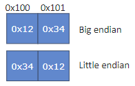

# Fundamental_types

## Integer

### Size and Types

- `1 == sizeof(char) <= sizeof(short) <= sizeof(int) <= sizeof(long) <= sizeof(long long)`
  - `1` 通常表示 **1 字节** 但在某些设备上也可能是其他大小, 比如 **4 字节**
- 位数关系：
  - `8 <= char`
  - `16 <= short, int`
  - `32 <= long`
  - `64 <= long long`

### Important Notes

#### Char Type  

- **`char`** is not guaranteed to be **`signed or unsigned`**;
   if you hope to use exact signed one, you need to explicitly use **`signed char`**.

#### Signed Integer Overflow  

- It's Undefined Behavior (**UB**) for **signed** integers to overflow.  
     > ***Example:***
     `127 + 1` for an 8-bit signed integer is UB.

#### Unsigned Integer Behavior  

- **Unsigned integer** is always `>= 0`.  
     Therefore, loops like `for (unsigned int a = xx; a >= 0; a--)` will result in an infinite loop!  
  - Example: `std::string::find` will return `std::string::npos`, which is typically used like `!= std::string::npos`.

  - Since **C++20**, functions like `std::cmp_xxx` defined in `<utility>` can safely compare **unsigned and signed integers (excluding bool/characters)**  
     > ***Examples:***
     > - `std::cmp_greater_equal(std::string::npos, 0)`
     > - `std::in_range<T>(x)` can also be used to check whether a value is representable by integer type `T`.

#### Division by Zero  

- It's **UB** for integers to divide by zero.

#### Integer Promotion  

- All **arithmetic operations** will promote integers that are **smaller than `int`** to **`int`** first.  
     ***That means:***
     `(unsigned) char/short` will be converted to `int` first, and then arithmetic operations will be done. Or `unsigned int` if `int` cannot represent them, in case `sizeof(short) == sizeof(int)`.

#### Fixed Width Integers  

- In `<cstdint>`, there are some fixed-width integers:
  - `std::int(x)_t`, `std::uint(x)_t` where `x = 8/16/32/64`.

  - If you want to write very general code, you can use:
    - `std::(u)int_least(x)_t`, where `x = 8/16/32/64`, meaning the integer type has the smallest size that is bigger than `x` bits.  
        > ***Example:***
        If a system supports 16/64 bits, `int_least8_t` has 16 bits.
    - `std::(u)int_fast(x)_t`, where `x = 8/16/32/64`, meaning the integer type is the one that works fastest in the architecture and is bigger than `x` bits.
    - `std::(u)intmax_t`, the biggest integer supported by the system.  
  - **Note**:  
    - In most cases, `std::uint8_t` is `unsigned char`. If you try to output the **address** of `std::uint8_t`, it will attempt to output a **C-string** (i.e., output content until null-termination), which is often unexpected.
    - You need to convert `std::uint8_t*` to `void*` to get the address.

### Bit Manipulation of Integers

In **C++20**, **`<bit>`** is provided to do this
**Note**
All functions in **`<bit>`** are for unsigned integers;
if you want to use in **signed** ones, you need to convert them to **unsigned** ones.

#### About the power of 2

- `std::has_single_bit` : check whether an integer has **only a single 1** in bits.
  - `std::bit_ceil` : get the **smallest** integer that is power of two and **not less** than the given value.**(二进制向上取整)**
    - if an integer `has_single_bit`, do nothing; else set the next bit of the highest 1 and clear all other bits.
    - If the highest bit has been set(i.e. result is not representable), UB.
    - The width can be got by `std::bit_width`, which returns `1 + log2𝑥` .
  - `std::bit_floor` : get the biggest integer that is power of two and not greater than the given value.**(二进制向下取整)**

#### For bit rotation

negative shift is also accepted

- `std::rotl(x, int shiftBits)`: left rotate **(左旋)**
  > e.g. shift 2 bits: 00011101->01110100
- `std::rotr(x, int shiftBits)`: right rotate **(右旋)**
  > e.g. shift 3 bits: 00011101->10100011

#### For counting (return int)

- `std::count(l/r)_(zero/one)`, count the number of consecutive 0/1 bits starting from left/right.
  > e.g. 12=00001100, `std::countl_zero` is 4, `std::countr_zero` is 2.
- `std::pop_count`, count the number of 1 in an integer.
  > e.g. 24 has 2 bits

#### Endianness of platform

Since **C++20**, you can use `std::endian` to check the endianness of platform

- `std::endian::little/big/native`, where native is the endianness of current platform.
If the current platform is mixed endian, then `native != little && native != big`

- Since **C++23**, you can use `std::byteswap` to swap an integer byte by byte.

## Floating point

### Bit Manipulation for Floating Point

functions in **`<bit>`** are all for unsigned integers
for floating point, need `std::bit_cast<ToType>(fromVal)` to cast a value to another type with the same bit contents.
**Only if sizeof(fromType) == sizeof(toType) can it succeed**

## Literal Prefix and Suffix

For literals, prefix(前缀) is used to identify format, and suffix(后缀) is used to identify type

### Notes
  
- 1 – int; 1l/1L – long; 1ll/1LL-long long
  Add a u/U will make them unsigned, e.g. 1u, 1ull, 1llu
- 10 – decimal(十进制); 0x10 – hexadecimal(16进制) (get 16); 010 – octal(8进制) (get 8)
- Since **C++14**
  - Binary(二进制) is supported, i.e. 0b10 (get 2).
  - Separator is supported, i.e. 0x11FF’3344; 0b0011’0100 (分隔符被支持)

## Final word

### Notes

- If you want to get special values for an arithmetic type, you may
use **`<limits>`**
  - e.g. **`std::numeric_limits<int>::max()`** get 0x7FFFFFFF (assuming 32 bit)
  **`std::numeric_limits<float>::max()`** get the maximum finite number
- There are lots of other limits like **`denorm_min`**
- You may also use things like **`INT32_MAX`** defined in **`<cstdint>`**; it’s more like a C-style way

### bool

special integer, only true (non-zero, not definitely 1) or false. But convert it to other integer types will get 1/0

- **`sizeof(bool)`** is not necessarily 1
- `bool` is not allowed to `++/--` since **C++17**
