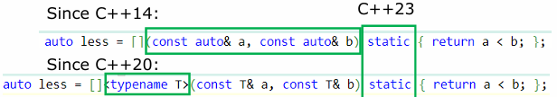

# Compound types

## Pointer Type & Reference types

### Pointer Type

In `C++`, **`NULL`** is just an integer rather than a pointer!

### Reference Type

**Differences** from pointer

- Reference is not nullable.
- Reference cannot change the referred object.
- Reference may or may not occupy any memory, while pointer will definitely.
- But this isn’t usually that important because of compiler optimization.
- Reference is forbidden to be template parameters in many parts of standard library, like you cannot **`std::vector<A&>`**.

## Array Types

### Notes

E.g. **`int a[3] = {1,2,3}, b[] = {4,5,6}`**;

- Though you may see **array as pointer** before, it’s **not true…**
    > That’s in fact **decay**

- A special array is *C-string*, e.g. **`const char* str = “test”`**;
  - “test” is **`const char[5]`**, but it may **decay** to **`const char*`**.
  - **`char*`** (drop **const** for string literals) here is not permitted in `C++`.
  - Null-terminated, so different with **char array itself**.
- There are no **array of functions** or **array of references**.
- VLA (i.e. **`int arr[n]`**) is not allowed in `C++`.

### Multidimensional array

E.g. `int a[2][3] = { {1,2,3},{4,5,6}}`;
All dimensions but the first should have explicit size

### Dynamic allocation

- **`malloc`** in C (function defined in **`<cstdlib>`**) and **`new/new[]`** in `C++` (as a *keyword*)
  - *Difference*: **`malloc`** will **only allocate memory**, **`new`** will **call ctor** if the object provides one
  - **`new`** and **`malloc`** will get **a pointer** instead of an array!
    - It points to the content of some continuous space
  - When memory is exhausted
    - **`malloc`** will return **`NULL`**
    - **`new`** will throw **`std::bad_array_new_length`**, an exception inherited from **`std::bad_alloc`**, defined in **`<new>`**
- Deallocation: **`free`** and **`delete/delete[]`**
  - They are not interchangeable; **`delete`** will **call dtor** of objects.
  - Deallocation will & should **always not throw exception**

## Function Types

### Function

- Function implementation (definition):
  - Param types and return type should be same as prototype
  - **default params** should **not appear here**.
  - The definition can specify return type as **`auto`** since **C++14**: it can be deduced from return statement (but **ref** and **const** is still not deduced.)
    - If types of **multiple return differ**, compile error
- The return type **cannot** be **function** or **array** (but **can** be their **references** or **pointers**)
  - shouldn’t return **references (and also pointers)** of **`local variables`**
    > since they will be destroyed after exiting the function, which makes them **dangling references/pointers**(悬空引用/指针)
-**`static`** **local variable**: “global variable” in the function, not directly accessible to others
  - Initialized iff. the first time its initialization is executed

### Understanding complex type

When the return type is **function pointer**, the prototype is like:

```cpp
int Bar(int) {return 0;}
int (*Foo(float realParam))(int) {return &Bar;}  

E.g. int(*Foo(int, int(*)(int)))(int(*)(float));
```

### Type alias

In C, you may use **`typedef`**, but it’s not as intuitive & powerful as **`using`**

- Particularly, it’s not same as pure text replacement! You see the alias **as a whole**.
- For example, **`using CPtr = char*; using ConstCPtr = const CPtr`** will not get **`const char*`**, but **`char* const`** i.e. the pointer itself cannot be changed.

### Attribute

- Sometimes, the return value of a function should not be omitted
  but there is no way to force users to notice that…
- Since **C++11**, **`[[attribute]]`** is introduced; this is a standard way to extend the language
- For function, you may use **`[[nodiscard]]`** since **C++17** before
return type to denote the return value should not be dropped.
  - Since **C++20**, you may specify reason as **`[[nodiscard(“reason”)]]`**
  - The compiler will report a warning if it’s dropped.
- It’s recommended to specify the attribute **both in declaration and in definition**

other attributes：

- **`[[deprecated]]`** and **`[[deprecated(“reason”)]]`** since **C++14**: mark the function as deprecated so that users should not use it in new code.
  - This can also be used in **namespaces** and **enumerators**
- **`[[noreturn]]`** since **C++11**: some functions may never return. Specify functions with this attribute will suppress the warning, and also tell users that this function will never return
- **`[[maybe_unused]]`** since **C++17**: when some entities (functions, variables including params) seem unused, compilers may report a warning. This will suppress the warning.

### Enumeration

E.g

```cpp
enum class Day : std::uint8_t {Monday, Tuesday, Wednesday = 10, Thursday, Friday, Saturday = 20, Sunday};
```

- you may use **`std::underlying_type<Day>::type`** or **`std::underlying_type_t<Day>`** (since **C++14**) to get the integer type (e.g. here is **`std::uint8_t`**); defined in **`<type_traits>`**
    > In **C++23**, you may also use **`std::to_underlying<Day>(day)`** to get the underlying integer directly; defined in **`<utility>`**
- it’s still **legal** to initialize like **`Day day{1}`**; (since **C++17**); But it’s **illegal** to use **`Day day = 1`**; or assign **`day = 1`**
- Enumeration is also widely used in **bitwise operation**
  > However, scoped enumeration **doesn’t support arithmetic operations**
  so you may either use unscoped one carefully (e.g. with namespace) or define the operator yourself
- you need to ensure not to exceed the limit of enumeration value in the meaning of bits **`(i.e. (1 << std::bitwidth(MaxEnum)) – 1 or (1 << (MSB(MaxEnum) + 1)) – 1)`**, otherwise **UB**

## Class

### Ctor&Dtor

- Notice that once the reference member is initialized, it cannot change the referred object. So if the object is actually destroyed, then the member is dangling!
- Ctor initializes data members in the same order of their declaration; destruction happens reversely (like a stack)
- Since **C++11**, **`Uniform Initialization`** is introduced.
  - (Almost) all initialization can be done by curly bracket{}.
  - Compared to (), it will strictly check **Narrowing Conversion**;
    - i.e. the converted type cannot represent all values.
    - e.g. if an **`uint32_t`** is used to initialize **`uint16_t`**, then compiler reports an **error**;
      you need to convert it manually if you want.
    - Even **`uint32_t`** to **`int32_t`** and vice versa forbidden, since the latter has negative values which cannot be represented by the former, and the former has larger positive values which cannot be rep.ed by the latter.
    - But if this value can be determined in compile time and it’s representable, then it’s still valid (e.g. const uint32_t a = 2 => uint16_t).
    - This facilitates type safety.
  - It can also prevent most vexing parse, e.g. Class a();/Class a(C2()); will be seen as a function prototype instead of a variable!
- **`Default initialization`**:
  T a, new T;
  - If T has a default ctor, it will be called.
  - Otherwise the memory is **random**, e.g. if T = int, then it’s possibly anything. It’s **UB** to read them before assigning them.
  - Members like this are also random if you forget to initialize them in ctor.
- **`Value initialization`**:
  No parameter for initialization; T a(), T a{}, new T{}, new T().
  - Compared to default initialization, this will zero-initialize other values, e.g. int a{}; will make a == 0 while int a; just makes it random.
  - It’s generally (not definitely, we may cover it in the future) recommended to use value initialization over default initialization.

### Polymorphism

- Besides, since members of children have been destructed when calling dtor in parent, it’s dangerous too…
- To conclude, don’t call any virtual function and any function that calls virtual function in ctor & dtor!
- Besides, you should usually make dtor of base class virtual.
- Reason: deleting `Base*` that cast from `Derived*` will lead to correct dtor

### Some Covert Facts in Inheritance

- C++ allows limited shift of return type in virtual override.
  you can return pointer/reference of child object if the overridden method returns pointer/reference of parent object.
  ***Example:***

  ```cpp
  Cherry* CherryTree::pick() {return new Cherry();}
  BingCherry* BingCherryTree::pick() { // 声明中可以写override
    return new BingCherry{};
  }
  ```

  Notice that smart pointers that will be covered in the future cannot be returned, since **`SmartPtr<Base>`** is not the parent of **`SmartPtr<Derived>`**.

- When virtual methods have default params, calling methods of **`Derived*/&`** by **`Base*/&`** will fill in the default param of Base methods
  ***Example:***
  
  ```cpp
  void Parent::Go(int i = 2) {std::cout << "Base's go with i=" << i << std::endl; } 
  void Child::Go(int i = 4) {std::cout << "Child's go with i=" << i << std::endl; } 
  Parent* p = new Child;
  p->Go(); // Child's go with i=2
  ```

- There is a pattern called **template method pattern** that utilize private virtual method.
  - The base class is called template class.
     It’ll call virtual methods in its methods so that the polymorphism can be utilized.
  - What derived classes need to do is just overriding those virtual methods, so the template class will automatically adjust them to intension of the derived.
  ***Example:***

  ```cpp
  class Student
  {
  public:
      float GetGPA() {return GetGPACoeff() * 4.0;}
  private:
      virtual float GetGPACoeff() {return 0.8;}
  };
  class JuanWang : public Student
  {
      virtual float GetGPACoeff() override {return 1.;}
  };
  ```

### Designated Initialization
  
  Since **`C++20`**, aggregate can also use designated initialization!
  ***Example:***
  
  ```cpp
  struct Priority { int val; };
  struct Point
  {
      int x, y;
      Priority priority[2];
  };

  int main()
  {
      Point p{.x = 1, .y = 2, .priority = {{.val = 1}, {.val = 2}}};
      return 0;
  }
  ```

  *Note:* array cannot use designated initialization though it’s an aggregate

### Function Overloading

In `C++`, functions can have the same name with different parameters
This is done by compilers using a technique called **name mangling**.
  
- Though two functions seem to have the same name, the compiler decorates each one to a unique symbol from the parameters and their types.
- **Return type** does NOT participate in name mangling!
  - Except that it’s a **template parameter**, since all template parameters are part of mangled name.

> E.g. for function **`namespace Namespace {int function(int x);}`**, it’s mangled in `msvc` as **`?function@NameSpace@@YAHH@Z`**, while in `gcc` as **`_ZN9NameSpace8functionEi`**.

### Operator Overloading

The `operator` will still accept the **same operands**, and you cannot define new symbol as operator.
But the type of operands are not required to be same
> e.g. you may write **`operator+(int, Vector3)`**

- as class methods:
  
  ```cpp
  Vector3 operator+(const Vector3& v) const{
      return Vector3{x + v.x, y + v.y, z + v.z};
  }
  ```

  In fact **`a.operator+(b)`**, so it’s obligation to make the object the first operand.
  
- as global functions:

  ```cpp
  friend Vector3 operator+(const Vector3& v1, const Vector& v2);
  Vector3 operator+(const Vector3& v1, const Vector& v2){
      return Vector3{v1.x + v2.x, v1.y + v2.y, v1.z + v2.z};
  }
  ```

  In fact **`operator+(a, b)`**, so `a` may be implicitly converted to `Vector3` when `b` is `Vector3`.

- You can overload:
  - **`+,-,*,/,%,|,&,^,<<,>>`**: recommend **global functions**; return new object.
    Specially, **`<<`** and **`>>`** can be used as insertion and extraction operator, which must be **global functions** since you cannot add methods for the stream class; we’ll show you sooner
  - **`+=,-=,*=,/=,|=,&=,^=,<<=,>>=`**: require **member functions**, since the first operand must be a “named” object; return reference(i.e. `*this`).
  - **`Prefix++&--`**: unary, require **member function**, return `*this`.
  - **`+,-,~,postfix++&--`**: unary, recommend **member function**, return new object.
    - Specially, postfix ++/-- have an unused parameter int, which is used to distinguish the prefix and postfix.
  - **`*,->`**: usually used in e.g. some wrapper of pointers; const is needed if the pointed element is const.
    - Particularly, **`->`** is actually **`(a.operator->())->`**
    ***Example:***

    ```cpp
    struct A{int a;};
    class MyAPtr
    {
    public:
        MyAPtr(int _a) : ptr{new A{_a}} {}
        ~MyAPtr() {delete ptr;}

        A& operator*() {return *ptr;}
        const A& operator*() const {return *ptr;}
        A* operator->() {return ptr;}
        const A* operator->() const {return ptr;}

    private:
        A* ptr;    
    };

    int main()
    {
        MyAPtr aPtr{0};
        A& a = *aPtr;
        int val = aPtr->a;
        return 0;
    }

    ```

  - **`&&,||`**: rarely overloaded, since short-circuit property of evaluation in Boolean expression doesn’t work
  - **`!`**: rarely because usually conversion to **`bool/void*`** is provided so that **`!`** will be explained as negation of that **`bool/void*`**.
  - **`new, new[], delete, delete[]`**: we’ll cover them in Memory Management.
  - **`,`**: Yes, you may even overload comma, but even more rarely.
  - **`&`**: Get the address; incredibly rare.
    So if you want to write some basic library, you should use **`std::addressof()`** defined in **`<memory>`** to get the exact address.
  - You cannot overload **`., ?:, ::, .*`**
  - **`<<`** and **`>>`** in stream:
    ***Example:***

    ```cpp
    class Real
    {
    public:
        friend std::istream &operator>>(std::istream &is, Real &r)
        {
            is >> r.val;
            return is;
        }
        friend std::ostream &operator<<(std::ostream &os, Real &r)
        {
            os << r.val;
            return os;
        }

    private:
        float val;
    };
    ```

    You can write them in class, though they are in fact **global functions**.
    > Compilers can find them by ADL(Argument-Dependent Lookup).(实参依赖查找)
- Conversion Operator:
  ***Example:***

  ``` cpp
  class B
  {
  public:
      int b;
  };

  class A
  {
  public:
      operator B() { return B{a}; }
      int a;
  };
  ```

  - No return type needed since the operator name just specifies it.
  - Notice that this is similar to add a **ctor** for B.
  - Similarly, you can add **`explicit`** to force user to convert it manually.
  - Particularly, for **pointer class** converted to **bool**, maybe to **`void*`** is **more proper** so **`p != nullptr`** is valid.
  - You can use **`operator auto(){ … }`** so that the type will be deduced from the return value
- comparison operator <=>
**`<,>,<=,>=,==,!=`**: You may find it annoying to overload them all with many duplicate codes…
  - **`a < b`** is right, but **`a >= b`** compiles error???
  - The standard library mostly uses < and == to get all relations, so that the burden can be reduced.
  - In **C++20**, this problem is completely solved by **spaceship operator** / **three-way comparison operator**: **`<=>`**.
    - First, let’s see how you get benefit from it!
      - **`<=>`** will deduce the **first four operators**.
      - **`==`** will deduce **`!=`**.
  - **`<=>`** actually returns **`std::strong_ordering`**, **`std::weak_ordering`** or **`std::partial_ordering`**, defined in **`<compare>`**.
    - For **`std::strong_ordering`**, it means only one of **`a > b, a < b, a == b`** will be **true**, and the other two is **false**.
      E.g. integer comparison.
    - For **`std::partial_ordering`**, it means three of them may all be **false**, when all relations get false, then it's an unordered relation.
      E.g. float comparison, **`NaN >/</==`** is all false.
      > Equal is in fact called **equivalent** here since -0 == 0 while they are different in binary.

      ```cpp
      double a = -0.; // double a = NAN;
      double b = 0.;  // double b = 5.0;
      auto result = a <=> b;

      if (std::is_lt(result))
          std::cout << "a is less than b" << std::endl;
      else if (std::is_eq(result))
          std::cout << "a is equal to b" << std::endl;
      else if (std::is_gt(result))
          std::cout << "a is greater than b" << std::endl;
      else
          std::cout << "a and b are unordered" << std::endl;
      ```

    - The ordering can be compared with 0.
      Relation with 0 is the underlying relation, e.g. <0 means <.
    - You can also use bool **`std::is_lt/eq/gt/lteq/gteq/neq(ordering)`** to judge what it is.
    - You cannot use it in **`switch`** since it’s **not integer**.
    - **`std::weak_ordering`** is not that useful.
      You may think two things are not equal strictly but make == true is this ordering, e.g. case-insensitive string
  - You may notice that **`<=>`** is enough to know **`==`**, so why do we need to overload it manually?
    For container, **`<=>`** is comparing every element one by one…
    e.g. **`STL`** in **`std::vector`**: **`==`** may be cheaper since it can check size first.
  - Besides, even if **`a < b`** where in fact only **`b.operator<=>(B{a})`** is valid, the compiler will not report errors since it will try **`b > a`** automatically!  
  - Finally, if you just want to compare members **one by one**, then you can make comparison operators default like:

    ```cpp
    auto operator<=>(const Person&) const = default;
    auto operator==(const Person&) const = default;
    ```

  - The **`<=>`** result is the first comparison result that makes == false; and it all == are true, then it’s just equal.
    The return type is the **weakest ordering** (strong->weak->partial), e.g. if there is a **double** as data member, it will return **`std::partial_ordering`**.
- **`operator()`**: you may accept any form of parameters; the object then act as if a function.
  - This object is called **function object** or **functor**.
- **`operator[]`**: you may accept **one** parameter; from the view of programmer, it’s just like an array, which is given an index and give out the content.
  - It’s really annoying that it can **only accept a single parameter** when you write a multi-dimension array.
  - Since **C++23**, this is finally solved! You can use multidimensional subscript in **`operator[]`** like:

    ```cpp
    class MDArr
    {
    public:
        MDArr(int initRow, int initCol) : row{initRow}, col{initCol} {}
        float &operator[](int i, int j) { return arr[i * row + j]; }
        const float &operator[](int i, int j) const { return arr[i * row + j]; }

    private:
        int row, col;
        float arr[100];
    };

    int main()
    {
        int rows = 2, cols = 3;
        MDArr arr{rows, cols};
        for (int row = 0; row < rows; ++row)
            for (int col = 0; col < cols; ++col)
                arr[row, col] = row * row + col;
        std::cout << arr[1, 2];
        return 0;
    }
    ```

    This is achieved by re-explaining the comma expression in [];
    that is, commas are regarded as separators of parameters.
  - Besides, [] and () can be **static** methods since **C++23**
    Though it’s **static**, it’s not necessary to call like **`S::operator()(…)`**;
    instead, **`S{}(…)`** will be optimized if **ctor** is default so that no actual object will be constructed.

### Lambda Expression
  
- Since **C++11**, lambda expression is added as “temporary functor” or closure
  - Beyond normal functions, lambda can capture something in the current context.
  - It is just an **anonymous struct** generated by the compiler, with an **`operator() const`**

- Basic format: **`auto func = [captures](params)->ReturnType{function body;};`**
  - **Captures** are actually members of the struct; you can also declare new variables.
  - ReturnType, params and function body are for operator().
  - **`-> ReturnType`** can be omitted when it can be deduced from return, just like auto.
  - Every lambda expression has its unique type.
  - **`()`** can be omitted if no parameter is passed
  - You may also combine **`= and &`**, e.g. **`[=, &carry] or [&, carry]`**
    Meaning that capture carry by ref/copy while others as copy/ref.
  
- Note:
  - static and global variables don’t need capture.
  - If you use lambda expression in a non-static class method and you want to access all of its data members, you may need to explicitly capture **`this`** (**`by reference`**, since only copy pointer) or **`*this`** (really copy all members).
    - Capturing all by **`= and &`** can omit it.
      - Since **C++20**, it’s forced to capture this explicitly even if there is =
  - You may add specifiers after **`()`**.
    - **`mutable`**: since **C++17**, remove const in operator(), i.e. for capture by value, you can modify them (but don’t really affect captured variable).
    - **`static`**: since **C++23**, same as **`static operator()`** (it’s always better to use it if you have no capture!).
    - **`constexpr/consteval/noexcept`**: we’ll introduce them in the future
  - It’s also legal to add attributes **between** **`[] and ()`**.
    Since **C++23**, if **`()`** is omitted, it’s legal to add attributes and specifiers
  
## Basic Control Flow

- Particularly, you can **`switch enumeration`** since it’s also kind of integer
  - **`BasicBufferType::xxx`** is the complete name, and it would be miserable to write it all in the switch statement!
    You may use **`using enum`** since **C++20**
    ***Example:***

    ```cpp
    enum class BasicBufferType {OnlyColorBuffer, OnlyReadableDepthBuffer,
      ColorBufferAndWriteOnlyDepthBuffer, ColorBufferAndReadableDepthBuffer}
    switch (type)
    {
        using enum BasicBufferType;
    case OnlyColorBuffer:
        // ...
        break;
    case OnlyReadableDepthBuffer:
        // ...
        break;
    // ...
    }
    ```

  - **`case xx:{}`** : {} is only necessary if you need to declare new variables in the scope.
  - **`break`** : Don’t forget to break every **`case`**!
    Sometimes you don’t break deliberately, e.g. two cases do the same thing.
    - This is called **fall through**.
    - To show that you’re deliberate and don’t forget it (also disable compiler warning), you may use the attribute **`[[fallthrough]]`** since **C++17**.
    ***Example:***
  
    ```cpp
    case 0:
        [[fallthrough]]
    case 1:
    {
        // ...
        break;
    }
    ```

- Since **C++20**, **`[[likely]]`** and **`[[unlikely]]`** are added
  - These two attributes are added for such optimization.
  - Usually, you only need to add them in hot spots found by profiling; otherwise it’s very likely to reduce performance (compilers / processors are smart enough!).
  ***Example:***
  
  ```cpp
  if(flag) [[likely]]{}
  switch(num)
  {
  [[likely]]
  case 0:
  {
      break;
  }
  }
  for(int i = 0; flag; ++i) [[likely]];
  ```

- You may want to give more hints than only branch prediction…
  - E.g. in loop unrolling, how many loops are combined together?
  - If the compiler can assume loop times % 32 is always 0, it may choose 32 so that no trailing process is needed!
  - Since **C++23**, you may use **`[[assume(…)]]`** to denote that!
    - You must ensure expression in assume is always true, otherwise UB.
      - So, use assume carefully! You shouldn’t use them to check or document preconditions, but use them to **utilize known preconditions**
      ***Example***

      ```cpp
      [[assume(times % 32 == 0)]]
      for(int i = 0; i < times; ++i>){}
      ```

    - There may also be many other possible optimizations,
      e.g. for **signed integer**, **`[[assume(x >= 0)]]`** may accelerate **`x / 2`** since positive ones can be **`x >> 1`** directly while negative ones need more concerns.
    - Particularly, **`[[assume(false)]]`** means here won’t be reached, same as **`std::unreachable()`** in **C++23** defined in **`<utility>`**

## Code Block With Initializer

Since C++17, you may code like:

```cpp
if(auto it = table.find(1); it == table.end())
  ; // do something
else
  ; // do something
```

- it is only valid in the if clause (including **`else-if, else`**)
  - You can also use **`auto x = …, y = …; x != y`** if they’re of the same type.
  - Notice that if initialized variable can be converted to **`bool`** implicitly, then it’s Okay not to write condition
- This is also available in **`switch-clause`** since **C++17**.
  You can also use e.g. **`auto p = xx; p[0] to switch p[0]`**.
- Since **C++20**, **range-based for loop** can also add an additional initializer, e.g. **`for(auto vec = GetVec(); auto& m : vec);`**
- Since **C++23**, type alias declaration can also be initializer, e.g. **`if(using T = xx; …)`**

## Template

- Lambda expression can also use template:
  
  [编译解构](https://cppinsights.io/s/013b1882)
  - This is same as an **anonymous struct**, with **`static operator()`** that is a **template function**
- Since **C++20**, abbreviated function template is introduced like: **`void Func(const auot& v){}`**
  - Every **`auto`** implicitly means **a new template parameter**, so you can also e.g. **`Func<int>`**
  - This is **different** from **generic lambda expression**, since the functor itself is not template, but its operator() is. You can pass the functor as parameter, but template cannot (and needs instantiation!).
  - It’s **strongly recommended** not mixing abbreviated template with **`template<typename T>`**, which will cause many subtle problems
  