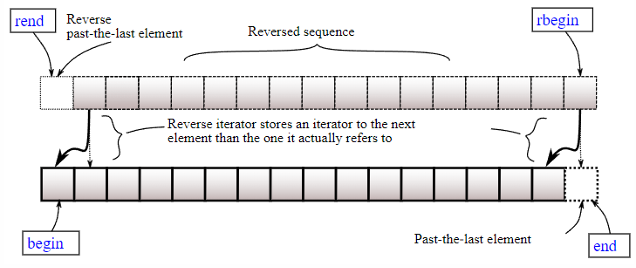
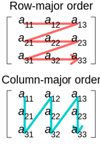

# Containers

## Foreword

- Some containers may have methods that **`<algorithm>`** has provided, but they are more efficient (otherwise why bother?)
- Before all these things, we may introduce two special integral type aliases defined in **`<cstddef>`**:
  - **`std::size_t`**: the type of **`sizeof()`**; this means the size of object cannot exceed the representable value of **`std::size_t`**
    - So, the maximum size of array is within **`std::size_t`**, so index is also within it.
    - Thus, in **containers**, all **`.size()`**-like thing will return **`std::size_t`**, and all **`operator[]`**-like thing for **array** will accept **`std::size_t`**.
    - It’s **`unsigned`**, and the signed version **`ssize_t`** is **not standard**.
    - Since **C++23**, you can use **`z`** as literal suffix for **`signed std::size_t`**, and **`zu`** as literal suffix for **`std::size_t`**.
  - **`std::ptrdiff_t`**: the return type of subtracting two pointers(**signed**)
  - They exist because they may be different on different platforms.
    - E.g. for **x86 & x64**, size_t is often respectively **32-bit/64-bit**.
    - **`ptrdiff_t`** is needed because on some old platforms, you need segments to represent the **array**, and pointer can only operate address in a segment

## Iterators

### Base

As its name, iterators are an abstraction of way to iterate over the containers and many other iterable things

- There are 6 kinds of iterators:
These iterators don’t have inheritance hierarchy, though the requirements are exactly more and more strict
  - **Input/Output iterator**:
    - for output, you can only do **`*it = val, it++, ++it and it1 = it2`**, provides **write-only** access
    - for input, you can also use **`==, != and ->`**, provides **read-only** access.
    These two iterators are **not for containers**, but for e.g. algorithm requirement of iterator and other things.
  - **Forward iterator**: same as input iterator, and can also be copied or default constructed.
    This is the **weakest** iterator for containers (e.g. **single linked list**).
  - **Bidirectional iterator**: same as forward iterator, and can also do **`--it, it--`**.
    - Can go in bi-direction one by one, e.g. for **double linked list**, **map**
  - **Random access iterator**: same as bidirectional iterator, and can also **`+/-/+=/-=/[]`** with an **integer** and be compared by **`</>/<=/>=`** (But for generality, we usually use **`!=`** in loop).
    - E.g. **deque**; This is almost equivalent to pointers in operations.
  - **Contiguous iterator** (since **C++17**): same as random access iterator, with an additional guarantee that memory occupied by iterators is contiguous.
    - E.g. **vector**, **string**.
- Since **C++20**, they become **concept**, so that if your iterators don’t match some requirements, the error information is more readable.
  - They are applied in algorithms for ranges; We’ll cover them later!
- **IMPORTANT**: Iterators are as **unsafe** as pointers.
  - They can be invalid, e.g. exceed bound.
  - Even if they’re from different containers, they may be mixed up!
  - Some may be checked by high iterator debug level
- All containers can get their iterators by:
  - **`.begin(), .end()`**
  - **`.cbegin(), .cend()`**: read-only access.
- Except for forward-iterator containers (e.g. single linked list):
  - **`.rbegin(), .rend(), .crbegin(), .crend()`**: reversed iterator, i.e. iterate backwards
- You can also use global functions to get iterators:
  - E.g. **`std::begin(vec), std::end(vec)`**.
  - They are defined in any container header.
- Notice that **pointers are also iterators!**
  - So, for **array type** (not pointer type), e.g. **`int arr[5]`**, you can also use **`std::begin(), std::end()`**, etc.
    - We just get two pointers, e.g. here **`arr`** and **`arr + 5`**.
- There are also general methods of iterator operations, defined in **`<iterator>`**.
  - **`std::advance(InputIt& it, n)`**: **`it += n`**(for non-random, just increase by **`n`** times). **`n`** can be negative, but it should be bidirectional.
  - **`std::next(InputIt it, n = 1)`**: return **`it + n`**, not change original one.
  - **`std::prev(BidirIt it, n = 1)`**: return **`it - n`**, not change original one.
  - **`std::distance(InputIt it1, InputIt it2)`**: return **`it2 – it1`**(for non random access, just iterate **`it1`** until **`it1 == it2`**)

> They have **ranges-version**, e.g. **`std::ranges::begin`**; use them since **C++20**

### Traits

- Iterators provide some types to show their information:
  - **`value_type`**: The type of elements referred to.
  - **`difference_type`**: The type that can be used to represent the distance between elements (usually **`ptrdiff_t`**).
  - **`iterator_category`**: e.g. **`input_iterator_tag`**. **`continuous_iterator_tag`** is added since **C++20**.
    - It’s recommended to use **`iterator_concept`** when it’s available instead of category in **C++20**, which has more precise description of the iterator, especially for iterator of **C++20 ranges**.
  - **`pointer`**: the type of pointer to the referred element, only available in container iterators.
  - **`reference`**: the type of reference to the referred element, only available in container iterators.
  - You may use **`std::iterator_traits<IteratorType>::xxx`** (defined in **`<iterator>`**) to get them (absent ones will be **`void`**)
- Since C++20, you can directly get them by:
  - **`std::iter_value_t<IteratorType> / std::iter_reference_t<IteratorType> / std::iter_const_reference_t<IteratorType> / std::iter_difference_t<IteratorType>`**
  - **pointer** and **category** are not provided directly.

### Stream Iterator

Beyond iterators of containers, stream iterators and iterator adaptors are also provided in standard library.

- When reading from input stream/writing to output stream in a simple and fixed pattern, you can use **`std::istream_iterator<T>`** and **`std::ostream_iterator<T>`** (respectively input and output iterator).
- They are **initialized** by the stream, e.g. **`std::cin/std::cout`**.
- The **initialization of istream_iterator** will **cause the first read**, **`*`** will get the value, **`++`** will trigger the **next read**.
***Example:***

```cpp
    std::vector<int> vec(5);
    std::istream_iterator<int> it{std::cin};
    vec[0] = *it;
    // output with \n as the separator
    std::ostream_iterator<int> out{std::cout, "\n"};
    for (int i = 1; i < 5; ++i)
        vec[i] = *(++it);
    for (auto &ele : vec)
        *(out++) = ele;
```

- However, they are mostly used with **`std::(ranges::)copy`**.

```cpp
    std::vector<int> vec(5);
    std::copy(std::istream_iterator<int>(std::cin), std::istream_iterator<int>(), vec.begin());
    std::copy(vec.begin(), vec.end(), std::ostream_iterator<int>(std::cout, "\n"));
```

- The default constructed **`istream_iterator`** is “end”; this means to terminate until the input stream cannot be parsed as **`int`** (e.g. input a non-digit character) or encounter with stream error (e.g. end of file for file stream).
  - So it’s dangerous because you may not assume the input of users, and the vector iterator may exceed its bound…
  - Some may hope to use **`std::copy_n(std::istream_iterator<int>{std::cin}, vec.size(), vec.begin())`**, but if the input stream reaches its end, the dereference is invalid too…
    - There is no **`copy_until`**!

### Iterator adaptor

- There are two kinds of iterator adaptors:
  - One is created from iterators to perform different utilities:
    
    - E.g. reversed iterators, i.e. the underlying type is also iterators, while **`++`** is in fact **`--`**.
      - You can construct from an iterator, i.e. **`std::reverse_iterator r{ p.begin() }`**.
    - You can get the underlying iterator by **`.base()`**, which actually returns the iterator that points to the elements after the referred one.
      - E.g. **`rbegin().base() == end()`**
    - There is another adaptor called move iterator, which will be covered in ***Move Semantics***
- Another is created from containers to work more than “iterate”.
  - **`std::back_insert_iterator{container}`**: **`*it = val`** will call **`push_back(val)`** to insert.
  - **`std::front_insert_iterator{container}`**: call **`push_front(val)`** to insert.
  - **`std::insert_iterator{container, pos}`**: call **`insert(pos, val)`** to insert, where **pos** should be an iterator in the container.
  - They are all output iterators, and **val** is provided by assignment
  ***Example:***

  ```cpp
  std::vector<int> vec;
  std::copy(std::istream_iterator<int>{std::cin}, std::istream_iterator<int>(), std::back_insert_iterator{vec});
  std::copy(vec.begin(), vec.end(), std::ostream_iterator<int>(std::cout, "\n"));
  ```

- Notice that inserting/assigning a range directly is usually better than inserting one by one (as done in **inserter**) for **`vector/deque`**.
  - Or at least “reserve” it before (we’ll learn them sooner).
- Final word: there are methods like **`std::make_xxx`** or **`std::xxx`** (e.g.**`std::back_inserter()`**, **`std::make_reverse_inserter()`**);
  You can also use these methods to get the corresponding iterator adaptors.
  - Before **C++17**, you have to specify the type parameter for template of class, so if you don’t use these functions, you have to write tedious **`std::back_inserter_iterator<std::vector<int>>(vec)`**.
  - Since **C++17**, **CTAD** (***Class Template Automatic Deduction***) will deduce it, so methods are generally not shorter than object initializations.

## Sequential Containers

### array

- We’ve learnt **C-style** array, e.g. **`int a[5]`**;
  - However, it will *decay* to **`int*`** when passing to function, and the size information is dropped.
    - i.e. the first dimension of the array parameter is meaningless, void func(**`int a[5]`**) is just same as **`void func(int a[])`** or **`void func(int* a)`**.
    - So, **`sizeof(a)`** is different inside and outside the function…
    - The **return type** cannot be **`int[5]`**, too…
  - For int **`a[5], b[5], a = b`** is invalid.
  - The bound is never check so invalid memory may be accessed…
- All in all, we need a safer array! **`std::array<T, size>`** is for you.
  - It’s same as **`T[size]`**, except that it always preserves size, can copy from another array, and can do more things like bound check.
- For ctor: just initialize **`std::array`** in the same way as **`C-style`** array (may need adding an additional pair of paratheses).
  - For example, **`struct S {int i; int j;};`**, **`std::array<S,2> arr{{ {1,2}, {3,4} }}`**.
- For member accessing:
  - **`operator[]/at()`**: accessing by index; **`at()`** will check the bound, i.e. if the index is greater than size, **`std::out_of_range`** will be thrown.
  - **`front()/back()`**: get the first/last element of vector.
  - Contiguous iterators, as we stated.
  - If you want to get the raw pointer of array content, you can use **`.data()`**.
- You can also use some additional methods:
  - **`.swap()`**: same as **`std::swap(arr1, arr2)`**.
  - **`operator=`**, **`operator<=>`**.
  - All these methods need same array size!
  - **`.fill(val)`**: fill all elements as val.
  - **`std::to_array(C-style array)`**: since **C++20**, get a **`std::array`** from a C style array.
- For size operations:
  - **`.size()`**: get size (return **`size_t`**).
  - **`.empty()`**: get a bool denoting whether **`size == 0`**.
  - **`.max_size()`**: get maximum possible size in this system(usually useless).

### vector

#### base

- To be exact, vector is dynamic array which can be resized.
  - It supports random access and occupies contiguous space.
  - When inserting and removing elements at the end (i.e. pushing / popping back), the complexity is **amortized 𝑂(1)**.
    - If not at end, it’ll be **𝑂(𝑛)**.
- This container is so important that we’ll spend lots of time on it.
  - It’s the most commonly used containers in all containers.
  - Though sometimes its theoretical complexity may be higher than other containers (e.g. list), it may still be a better choice since it significantly **utilizes cache**.
    - We’ve learnt in ICS that a cache-friendly program may consume hundreds or even thousands times less time than a bad one.
    - Use a profiler if you cannot determine which one is better!
- the most naïve version of vector is:
  - When pushing back, allocate continuous space with one more, copy* all and add the new one to the new space, finally freeing the original.
    - You cannot directly allocate one new space since it cannot guarantee the property of array - “contiguous space”.
  - When popping back, shrink the space by one and copy all rest to the new one, finally freeing the original.
- Obviously, you need **𝑂(𝑛)** on every pushing or popping…
  - So, what if we “prepare” more space than needed in allocation, so that pushing will only construct new object at back?
  - This is **𝑂(1)**, and we just need to control **reallocation** to happen only rarely so that copying will be **amortized 𝑂(1)**.
  - The element number is called **size**; total space is called **capacity**
- The easiest strategy is increasing space linearly.
  - E.g. 0->4->8->12->16…
  - Every `𝑘` operations will trigger reallocation and copy **`𝑛 = 𝑘𝑚`** elements.
  - So, the amortized complexity is $:\Theta\left(\frac{\sum_{i=1}^{m}ki}{km}\right)=\Theta(m)=\Theta(n/k)$
  - Considering that 𝑘 is an constant, this is still **𝑂(𝑛)**.
  - This means “linear” is not “rare”!
- So, what about exponentially?
  - E.g. 1->2->4->8->16->32…
  - Every $2^{k}$ operations will trigger reallocation and copy $n=2^{k}$ elements
    - So, the amortized complexity is $\Theta\left(\frac{\sum_{i=1}^{k}2^{i}}{2^{k}}\right)=\Theta(1)$
    - Summation of arithmetic progression v.s. geometric progression.
- vector also supports insertion of a range.
  - So more than one elements may be inserted.
- Considering that some insertion will make >2x growth.
  - You may calculate the smallest capacity that is larger than needed.
  - In **MSVC**, it directly allocates needed space, which is cheaper
- Finally, why is the exponent 2?
  - You can prove that for any **exponent > 1**, the amortized complexity is **𝑂(1)**.
  - This is a trade-off between **space** and **time**.
    - If the exponent is too low, reallocation will happen more frequently so that the constant of **𝑂(1)** is larger.
    - If it’s too high, the space will be consumed quickly so that you may waste a lot.
  - This is just one practical choice (e.g. in **gcc**).
- In **MSVC**, it’s **1.5**.
  - This considers more than trade off.
  - Facebook Folly Doc: *Despite other compilers reducing the growth factor to 1.5, gcc has staunchly maintained its factor of 2. This makes std::vector cache-unfriendly and memory manager unfriendly.*
- if **`exponent == 2`**
  - You will find that reallocation will never utilize the freed space!
  $\left(1+2+\cdots+2^{k-1}\right)<2^{k+1}$
- if **`exponent == 1.5`**
  - $\left(1.5+1.5^2+\cdotp\cdotp\cdotp+1.5^{k-1}\right)=2*(1.5^k-1.5)>1.5^{k+1}$ may be true.
  - Practically friendly to memory management and cache.
- To sum up,
  - Vector is just a dynamic array.
    - It occupies contiguous space and can be random accessed by **`[]`**.
    - It has members as: **pointer to content**, **size** and **capacity**.
      - In implementation, they are **first pointer**, **last pointer** and **end pointer**.
  - When the vector is full, it’s basically reallocated exponentially so that **`push_back`** is **𝑂(1)**
- Obviously, **popping back** is **𝑂(1)**.
  - You may think the vector will shrink when $\frac{size}{capacity}$ is too low!
    - The analysis is similar to appending, you can prove it’s **amortized 𝑂(1)**.
  - However, practically, vector doesn’t shrink automatically for efficiency, but it gives you ways to shrink it manually.
  - Besides, automatic shrink will violates regulation on iterator invalidation, which will be covered sooner
- For insertion, implementation you may have learnt is:
  - Move backwards (prevent overwriting) from the **final element**.
  - Insert into the empty positions.
  - Removal is similar, but move forwards from the end of deletion to the deletion point, and finally destruct the last several elements.
  - If reallocation is needed, operations of copying from old to new and copying in insertion can be merged
- However, **MS-STL**’s implementation of insertion doesn’t use this way (we’ll tell you why in the future); It is:
  - Reallocate if needed (same as normal insertion).
  - push_back all elements one by one.
  - **Rotate** them to the insertion point.

#### Initializer list

- In list initialization, we may use { 1, 2 } to pass params to ctor/function.
- However, how is it possible to unify the initialization of vector and C array?
  - All in all, we need to pass “a list of elements” to ctor! How is it represented?
  - By **`std::initializer_list`**.
- So, when a class accepts **`std::initializer_list<T>`**, { … } **whose elements are of type** **`T`** **or can be converted to** **`T`** will be regarded as **`std::initializer_list<T>`** rather than separate params!
  - Then, you can use **`std::vector<int> v{1,2,3,4}`** to initialize the vector (**Uniform**).
  - So, when you actually want to use **`(size_t count, const T& elem = T{})`**,
  when **`T`** is e.g. **`int`**, you cannot use **`v{10, 1}`** to construct a vector with 10 elements that are all 1.
    - You have to use **`v(10, 1)`**.
- Finally, **`std::initializer_list<T>`** can be roughly seen to have underlying **`const T[N]`**, with methods **`begin`**, **`end`** and **`size`**

#### methods

let’s have a look on methods provided by vector (return **`void`** if unspecified)

- For ctor:
  - Default ctor.
  - Copy ctor & Move Ctor.
  - **`(size_t count, const T& elem = T{})`**: construct a vector with **count** copies of **elem**.
  - **`(InputIt first, InputIt last)`**: copy elements from **`[first, last)`** into the vector.
  - **`(std::initializer_list<T>)`**: copy all elements from **`initializer_list`** into the vector.
  - All ctors have an optional allocator parameter.
- For member accessing (same as array):
  - **`operator[]/at()`**: accessing by index; **`at()`** will check the bound, i.e. if the index is greater than size, **`std::out_of_range`** will be thrown.
  - **`front()/back()`**: get the first/last element of vector.(**vector cannot be empty**)
  - Contiguous iterators, as we stated.
  - If you want to get the raw pointer of vector content, you can use **`.data()`**.
- For capacity operations (i.e. adjust memory):
  - **`.capacity()`**: get capacity (return **`size_t`**).
  - **`.reserve(n)`**: expand the memory to make **`capacity = n`** if it’s greater than the current capacity (else do nothing); but the **size** is not changed.
    - You may prevent reallocation over and over again (especially push_back many times) by **`reserve`** first!
      - This is dramatically important in some parallel programs because of iterator invalidation; we’ll talk about this sooner.
  - **`.shrink_to_fit`**: request to shrink the capacity so that **`capacity == size`**.
    - This is the general way for you to shrink; request may or may not be accepted.
    - For mainstream implementation (**libc++/libstdc++/MS STL**), shrink will happen basically as long as your class can be copied or moved without exception and space is enough for a new vector. This is because of exception guarantee, which will be covered in the following lectures!
- For size operations (i.e. operate on elements, possibly influence capacity implicitly)
  - **`.size()`**: get size, return **`size_t`**.
  - **`.empty()`**: get a bool denoting whether **`size == 0`**.
  - **`.max_size()`**: get maximum possible size in this system (usually useless).
  - **`.resize(n, obj=Object{})`**: make the size = n;
    - If the original size is n, nothing happens.
    - If greater than n, elements in **`[n, end)`** will be removed.
    - If less than n, new elements will be inserted, and their values are all **`obj`**.
  - **`.clear()`**: remove all things; size will be 0 after this.
    - But the capacity is usually not changed! You need to use capacity-related operations explicitly if you want to clear memory as well.
  - **`.push_back(obj)`**: insert an element at the end.
  - **`.emplace_back(params)`**: insert an element **constructed** by **`params`** at the end.
    - Since **C++17**, it returns reference of inserted element (before it’s **`void`**).
  - **`.pop_back()`**: remove an element from the end.
  - **`.insert(const_iterator pos, xxx)`**: insert element(s) into pos, so that **`vec[pos – begin]`** is the first inserted element. **`xxx`** is similar to params of ctor:
    - **`(value)`**: insert a single element.
    - **`(size_t count, value)`**: insert count copies of **`value`**.
    - **`(InputIt first, InputIt last)`**: insert contents from **`[first, last)`**.
    - **`(std::initializer_list<T>)`**: insert contents of initializer list.
  - **`.emplace(const_iterator pos, params)`**: insert an element **constructed** by **`params`** into pos.
  - **`.erase(const_iterator pos)/.erase(const_iterator first, const_iterator last)`**:
  erase a single element/ elements from **`[first, last)`**. **`first`**, **`last`** should be iterators of this vector.
    - insert/erase will return next valid iterator of inserted/erased elements, so you can continue to iterate by **`it = vec.erase(…)`**. We’ll tell you reason sooner.
- Interact with another vector:
  - **`.assign`**: also similar to ctor
    - **`(vec)`**: same as **`operator=`**, assign another vector
    - **`(count, const T& value)`**
    - **`(InputIt first, InputIt last)`**
    - **`(std::initializer_list<T>)`**.
  - **`.swap(vec)`**: swap with another vector, same as **`std::swap(vec1, vec2)`**
- Since **C++23**, ranges-related methods are added.
  - **`.assign_range(Range)`**: can copy any range to the vector.
  - **`.insert_range(const_iterator pos, Range)`**
  - **`.append_range(Range)`**: insert range from the end.

#### Iterator Invalidation

- Obviously, the iterator is designed as a wrapper of the pointer to the element.
  - All operations are just for pointers, e.g. **`+/-`** is just moving pointers.
  - But pointers are **unsafe**!
- An iterator may be unsafe because it may not correctly represent the state of the object it is iterating. This may be caused by:
  - **`reallocation`**, the original pointer is dangling; dereferencing the iterator will access unknown memory.
  - **`On insertion & removal`**, so the original pointer points to an element that it may not intend to refer.
    - e.g. **`1 2 3 4`** and **`it`** points to 3; after removing 2, **`it`** points to 4, which is in fact **`it + 1`** in the original context!
  - This is called **iterator invalidation**.
- For vector:
  - If the **capacity changes**, **all iterators** are **invalid**.
  - If the **capacity doesn’t change**, but some elements are moved, iterators **after the changed points** are **invalid**.
    - i.e. inserting/removing will make iterators after the insertion/removal point invalid.
    - That’s why insert/emplace will return a new iterator referring to the inserted element, and erase will return one after the final removed element.
      - You may use them to continue to iterate the vector.
- We say vector is thread-unsafe because:
  - It is only safe when two threads are reading the vector.
  - If one is writing, the other may read inconsistent content (e.g. for a vector of pair, you may read an old first and a new second…).
  - When the internal structure of the container changes (e.g. vector reallocated when inserting), another thread will access invalid memory (i.e. unexpected iterator invalidation)…
- But if you can ensure that threads are just writing different elements, it’s basically OK.
  - Particularly, since **`vector<bool>`** is still dangerous if two bits are in e.g. the same byte (you’ll understand it in the next page)…
- Final words:
  - vector supports comparison, as we stated in **`operator<=>`**.
  - If you just want to remove all elements that equals to XXX in a vector, it’s costly to use erase repeatedly ($O(n^{2})$ obviously)…
    - We’ll teach you **𝑂(𝑛)** method in the next lecture.
    - You may just use **`std::erase(vec, val)/std::erase_if(vec, func)`** since **C++20**; they return number of removed elements
  
#### **`vector<bool>`**

- **`vector<bool>`** is a weird specialization of vector…
  - **Boolean** can be represented by only **1 bit**, so **`vector<bool>`** is regulated to be compacted as “dynamic array of bit”.
  - However, the smallest unit that can be directly operated is byte, and you cannot return **`bool&`** for **`operator[]`** here!
    - What is returned is **a proxy class of the bit**.
      - For **const method**, it still returns **`bool`**.
  - You can get/set the bit through this proxy, just like normal reference.
  - This may be confusing sometimes, e.g.
    - For **`vector<int>`**, auto **`a = vec[1]; a = 1;`** will not change the vector since auto will not deduce reference.
    - However, for **`vector<bool>`** , **`auto`** is **proxy**, and this proxy holds the reference of the bit, so this will change the vector!
    - **`Range-based for`** may use **`auto`**, so pay attention if you’re doing so!
- Besides, since the returned proxy is a value type instead of reference, so the returned object is temporary!
  - Then, you cannot use **`auto&`** when iterating **`vector<bool>`**, though it’s right for other types…
  - To **`sum up`**, use **`auto`** rather than **`auto&`** if you want to change elements of **`vector<bool>`**, use **`const auto&`** or **`bool`** if you don’t want to change.
- Specialization also brings more methods…
  - proxy supports **`operator~`** and **`flip()`**, which will flip the referred bit;
  - **`vector<bool>`** supports **`flip()`**, which will flip all elements in the vector.
  - **`vector<bool>`** is supported by **`std::hash`**, which will be covered in the unordered map(i.e. hash table).
- Final word
  - For its unfriendly properties for generic code and novices, **`vector<bool>`** is discouraged by many. Besides, operating bits is also slower than bytes, and reducing the memory seems unnecessary in the modern computers.
  - Its iterator is also not seen as contiguous.
  - So, be cautious and careful if you want to use/process this type!

### Bitset

- **`bitset`** is in fact not a container, and we cover it here just because it also has many bits like vector<bool>…
  - However, the size is determined at compile time, i.e. you need to specify **`bitset<size>`**.
  - **`vector<bool>`** to **`bitset`** is similar (**not same**) to **`vector`** to **`array`**!
- Difference:
  - **`bitset`** doesn’t provide iterators.
  - **`bitset`** provides more methods, which makes it a more proper way to manipulate bits.
    - You may use **`&,|,^,~,<<,>>`**, just like operating binary series.
    - You can use **`set(), set(pos, val = true), reset(), reset(pos), flip(), flip(pos)`** to make all bits 1/0/flipped or set bit at pos val/0/flipped.
      - **`pos`** is index (**`size_t`**) since **`bitset`** doesn’t support iterator.
    - You can use **`all(), any(), none(), count()`** to check whether all/if any/whether none of bits are set / get number of set bits.
    - It can also be input/output by **`>>/<<`**
- Besides, **`bitset`** can be converted to **`std::string/unsigned long long`** by **`.to_string(zero = ‘0’, one = ‘1’)/to_ullong()`**.
  - The former may throw **`std::bad_alloc`** for allocation error on string
  - The latter may throw **`std::overflow_error`** if the value is unrepresentable by **`unsigned long long`**.
  - **`bitset`** can also be constructed by a **`string/unsigned long long`**, i.e. **`(str, start_pos = 0, len = std::string::npos, zero = ‘0’, one = ‘1’)`**.
    - No need to remember; check in cppreference when needed.
- Similarity:
  - You can access the bit by **`operator[]`**, which returns a proxy class too (for const methods, **`bool`** too).
    - There is no **`at(pos)`** in **`bitset`**, but a **`bool test(pos)`**, which will do bound check.
  - You can compare two bitsets (only in the same size, and only **`==`** and **`!=`**)
  - You can get size by **`.size()`**.
  - You can hash it by **`std::hash`**.
  
### span

- Since **C++17**, more and more view-like things are provided.
  - View means that it doesn’t actually hold the data; it observes the data.
  - So, their construction and copy are much cheaper than traditional containers.
- Span is a view for contiguous memory (e.g. **vector, array, string, C-style array, initializer list, etc**.).
- Before, you may have written things like **`void func(int* ptr, int size)`**.
  - Even if there are things like **`vector`** and you may use their references as parameters, what if you only want to operate on e.g. a sub-vector?
    - You have to copy it to a new container, which is costly…
  - Span is for this case; you can code **`void func(std::span<int> s);`**.
- You can just operate span almost as if operate on an array.
  - You can use random access iterators.
  - You can use **`front()/back()/operator[]/data()`**.
  - You can use **`size()/empty()`**.
- You can also use **`size_bytes()`** to get size in byte.
- You can create new sub-spans in span cheaply:
  - **`.first(N)/.last(N)`**: make a new subspan with the first **`N`**/the last **`N`** elements.
  - **`.subspan(beginPos(, size))`**: make a new subspan begin at **`beginPos`** with **`size`** (by default until the last one).
- Remember: **span is just a pointer with a size!** All copy-like operations are cheap.
  You can also use **`std::as_bytes`** and **`std::as_writable_bytes`** that convert a **span** to a **span of bytes**.
***Example***

```cpp
void printInfo(std::span<int> span)
{
    auto size = span.size();
    for (size_t i = 0; i < size / 2; ++i)
        span[i] *= 2;
    for (size_t i = size / 2; i < size; ++i)
        span[i] *= 3;
    for (auto it = span.begin(); it != span.end(); ++it)
        std::cout << *it << " ";
    std::cout << std::endl;
}

void demo_v6()
{
    std::vector<int> a{1, 2, 3, 4, 5};
    std::array<int, 4> b{1, 2, 3, 4};
    int c[]{1, 2, 3};
    printInfo(a);
    printInfo(b);
    printInfo(c);
}
```

- You can also create a span with a **`[begin, end)`** iterator pair or **`(begin, size)`** pair.
- Notice that spans will ~~never~~(**C++26** adds **`.at()`**) check whether the accessed position is valid!
  - E.g. You can use **out-of-range** index for **`operator[]`**.
  - You should carefully manage it!
- Span is in fact **`std::span<T, extent>`**, but the **`extent`** is **`std::dynamic_extent`** by default.
  - For **fixed extent**, it’s even more dangerous since you can assign a range that in fact doesn’t have extent elements (but they need explicit construction).
    - Only **C-style array** (i.e. **`T[extent]`**) and **`std::array<T, extent>`** can implicitly construct it.
    - Also, you need **`.first/last<N>()`**, **`.subspan<offs, N>()`** to create subspan with fixed extent (.subspan<offs>() will create fixeddynamic one for fixed/dynamic span).
  - You can get the extent by the static member extent.
- Notice that since **C++17/20**, **`std::data()/empty()/size()/ssize()`** can be used to get the raw pointer, etc., just like **`std::begin`** to extract the iterator.
  - However, in **C++20**, you should prefer **`std::range::data()/begin()/…`**, which is safer and has many other advantages;
- Final word: if you hope the **`span`** has **read-only** access, you need to use **`std::span<const T>`**.
  - This actually makes the pointer **`const T*`**, so it’s read-only.
  - However, for containers, you need to specify as **`const std::vector<int>`**.
    - That’s because spans are observer, and containers are the owner!

### mdspan*

- Since **C++23**, a multi-dimensional span is also provided.
  - It’s still a **non-owning view**, providing a multi-dimensional **`operator[]`**!
  - For owning one, mdarray may be provided in **C++26**…

- There are three components for mdspan:
  - Extent: We need a multi-dimensional extent, too; so it’s written as **`std::extent<IndexType, sizes…>`**.
  E.g. **`std::extent<std::size_t, 3, 2, 4>`**.
  - Similarly, you may hope to make some dimensions dynamic, then you can still use **`std::dynamic_extent`**, e.g. **`std::extent<std::size_t, std::dynamic_extent, 2, std::dynamic_extent>`**.
  - Obviously, the **most frequently** used one is that all dimensions are dynamic, so you can abbreviate it as **`std::dextent<IndexType, dimensionNum>`**.
- Layout: By default **`std::layout_right`**.
  - You may know that **Fortran** and **C/C++** have different layouts in array.
    - In **C/C++**, the last dimension(i.e. the rightmost one) is contiguous.
      - Row major, i.e. rows are stored one by one.
    - In **Fortran**, the first dimension(i.e. the leftmost one) is contiguous.
      - Column major, i.e. columns are stored on by one.
  
- The final component is accessor, which is std::default_accessor by default.
  - That is, when you get index, how do you access the memory?
    - The default one is just **`eturn mem[i]`**, but E.g. you may want to add a lock…
  - So, you need to define **`access(pointer, index)`** that returns a **reference** to the element and **`offset(pointer, index)`** that returns a **pointer** to the element.
 • This is rarely used, and default one is enough.
**But all in all, the most frequently-used is just** **`std::mdspan<T, std::dextent<IndexType, DimNum>>`**.

### Deque

Double-Ended Queue

- The most significant requirement of deque is:
  - **𝑂(1)** on insertion & removal of elements at the front or the back.
  - Random access.
- Other properties are just like **`vector`**, e.g. **𝑂(𝑛)** insertion & removal.
  - For methods, except that it provides **`push_front, emplace_front, pop_front`** (and prepend_range since **C++23**), all things (including **ctors**) are the same as a normal **`vector`**, so we’ll not repeat it.
- What is important is how it’s implemented.

